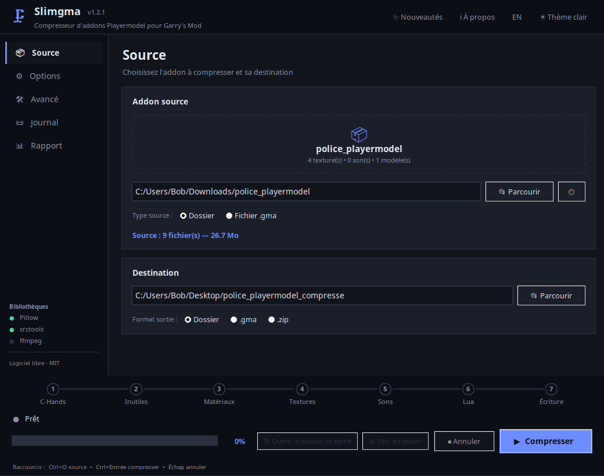
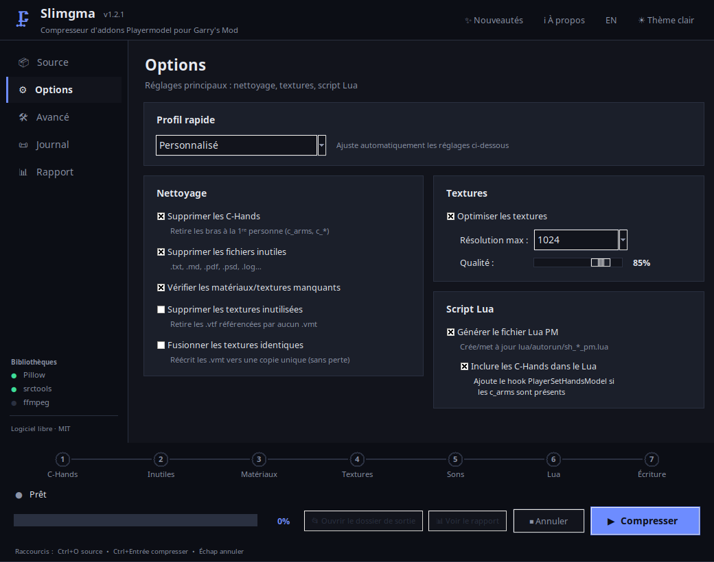
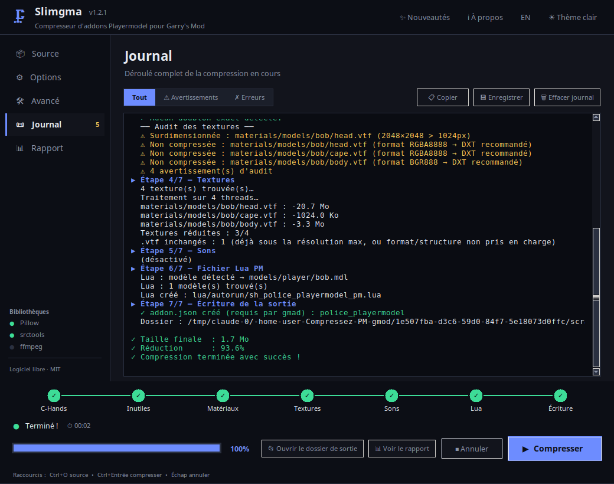
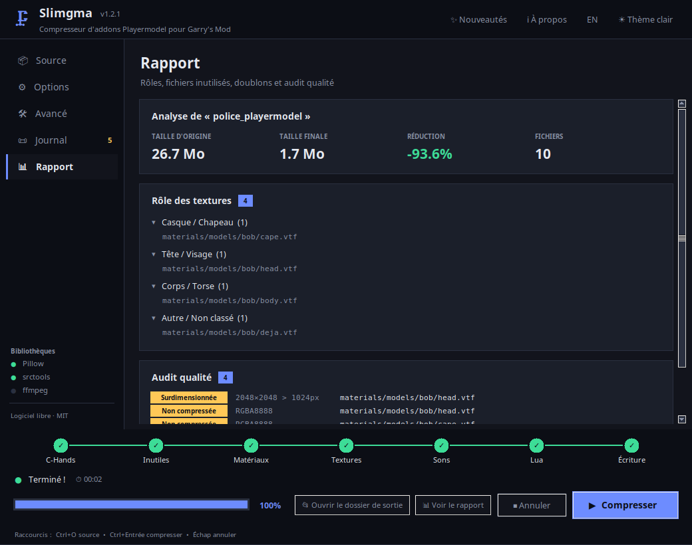
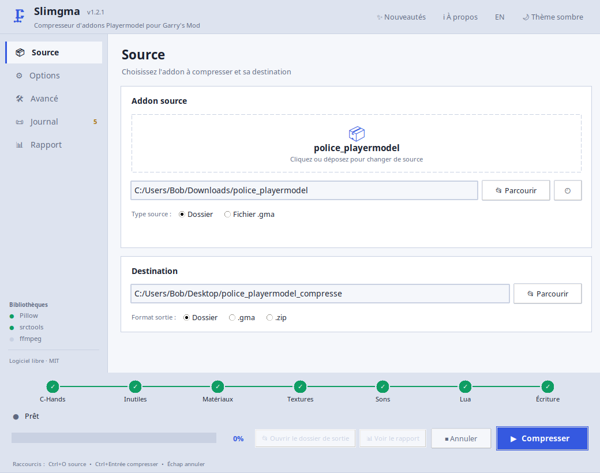

<div align="center">

# 🗜️ Slimgma

### Vos addons Garry's Mod, en plus léger.

Votre playermodel pèse 200 Mo ? Il peut peser 20. Un outil gratuit qui allège
vos addons **Playermodel**, sans les casser et sans que ça se voie en jeu.

[](LICENSE)
[](https://github.com/TenGoKu13/SlimGMA/actions/workflows/build.yml)
[](https://github.com/TenGoKu13/SlimGMA/releases/latest)
[](https://www.python.org/downloads/)



</div>

---

## À quoi ça sert ?

Les playermodels du Workshop sont souvent **énormes pour rien** : des textures
en 2048×2048 qu'on ne distingue pas en jeu, des fichiers stockés sans
compression, des copies en double, des `.psd` et des `.txt` oubliés dedans.

Cet outil s'occupe de tout ça et vous rend un addon **prêt à publier**.

| Avant | Après |
|---|---|
| 26,7 Mo | **1,7 Mo** |

*(mesuré sur l'addon de test du projet — le gain dépend de votre addon,
comptez souvent entre 50 % et 90 %)*

---

## Ça marche comment ?

### En 3 étapes

**1. Déposez votre addon** — un dossier ou un fichier `.gma`, glissé dans la
fenêtre ou choisi avec *Parcourir*.

**2. Choisissez un profil** — *Équilibré* convient à presque tout le monde.
Si vous voulez régler vous-même, tout est dans l'onglet *Options*.

*Vous ne voulez pas gérer un dossier de sortie ?* Cochez **Remplacer l'addon
d'origine** : votre dossier est compressé sur place.

**3. Cliquez sur Compresser.** C'est fini.

<div align="center">

</div>

### Vous voyez ce qui se passe

L'outil ne travaille pas dans votre dos : les 7 étapes défilent en bas de la
fenêtre, avec le fichier en cours de traitement et le temps écoulé.

<div align="center">

</div>

### Et il vous explique ce qu'il a fait

À la fin, l'onglet **Rapport** vous dit exactement ce qui a été trouvé dans
votre addon : à quoi sert chaque texture, lesquelles ne servent à rien,
lesquelles sont en double, et lesquelles posent problème.

<div align="center">

</div>

---

## Installation

### La façon normale (Windows)

**[⬇ Télécharger le programme d'installation](https://github.com/TenGoKu13/SlimGMA/releases/latest)**

Prenez le fichier `Slimgma-Setup-x.y.z.exe`, lancez-le, suivez les trois
écrans. Comme n'importe quel logiciel :

- **pas de demande d'administrateur** — Slimgma s'installe dans votre compte,
  pas dans le système ;
- **un raccourci dans le menu Démarrer** (et sur le Bureau si vous le
  cochez) ;
- **une entrée dans *Paramètres → Applications installées*** pour le
  **désinstaller** proprement, ou le mettre à jour en réinstallant par-dessus ;
- à la désinstallation, il vous demande si vous voulez **garder vos réglages**
  (langue, thème, derniers dossiers) au cas où vous réinstalleriez plus tard.

### La façon portable (Windows)

**[⬇ Télécharger Slimgma.exe](https://github.com/TenGoKu13/SlimGMA/releases/latest/download/Slimgma.exe)**

Un seul fichier, rien d'installé, rien dans le registre. Posez-le où vous
voulez — bureau, clé USB, dossier de l'addon. Pratique sur un PC qui n'est pas
le vôtre. En échange, il démarre un peu plus lentement et vous devrez le
retélécharger à chaque mise à jour.

> **Windows affiche « Windows a protégé votre ordinateur » ?**
> C'est normal, et ça arrivera avec les deux fichiers : ils ne sont pas signés
> (un certificat coûte ~300 €/an). Cliquez sur *Informations complémentaires*
> puis *Exécuter quand même*. Si vous préférez ne pas faire confiance à un
> `.exe` — ce qui est un réflexe sain — installez depuis les sources juste en
> dessous : c'est le même code, et vous pouvez le lire.

### Depuis les sources (Windows, Linux, macOS)

```bash
git clone https://github.com/TenGoKu13/SlimGMA.git
cd SlimGMA
pip install -r requirements.txt
python slimgma.py
```

Python 3.10 ou plus récent. Pour compresser aussi les **sons**, installez
[ffmpeg](https://ffmpeg.org/download.html) — sinon tout le reste fonctionne.

---

## Ce que l'outil sait faire

### Alléger

| | |
|---|---|
| 🖼️ **Réduire les textures** | Les passe en 1024 px (ou 512, ou ce que vous voulez). Invisible en jeu sur un playermodel. |
| 📦 **Recompresser en DXT** | Les textures stockées sans compression deviennent 4 à 8× plus légères, sans perte visible. |
| ⧉ **Fusionner les doublons** | Deux textures identiques ? Il n'en garde qu'une et met les matériaux à jour. Aucune perte. |
| 🗑️ **Faire le ménage** | Supprime les `.txt`, `.psd`, `.log` et autres fichiers qui n'ont rien à faire dans un addon. |
| 🔊 **Compresser les sons** | Ré-encode chaque son sans changer son format, donc sans casser vos scripts. |
| ✋ **Retirer les C-Hands** | Les bras à la première personne, inutiles si votre addon n'est qu'un playermodel. |

### Vérifier

| | |
|---|---|
| 🔍 **Textures manquantes** | Repère les textures que vos matériaux réclament mais qui ne sont pas dans l'addon. |
| 🧹 **Fichiers inutilisés** | Suit les liens modèle → matériau → texture et signale ce qui ne sert à personne. |
| ✅ **Compatibilité GMod** | Certains fichiers empêchent un `.gma` de se monter. L'outil les signale et peut les retirer. |
| ⚠️ **Audit qualité** | Textures trop grandes, non compressées, ou dont la taille n'est pas une puissance de 2. |

### Vous simplifier la vie

| | |
|---|---|
| 📝 **Script Lua automatique** | Génère le fichier qui enregistre votre playermodel dans le menu du jeu. |
| 🎯 **Taille cible** | « Je veux moins de 10 Mo » — l'outil trouve les réglages tout seul. |
| 👀 **Mode aperçu** | Montre ce qu'il ferait, sans rien écrire sur le disque. |
| 📚 **Mode lot** | Plusieurs addons d'un coup. |
| ♻️ **Compresser sur place** | Pas envie de gérer un second dossier ? L'addon d'origine est remplacé directement. |
| 💾 **Sauvegarde** | Copie horodatée avant d'écraser quoi que ce soit. |
| 🌍 **Français / English** | Toute l'interface, d'un clic. |
| 🌓 **Thème clair ou sombre** | Au choix. |

<div align="center">

</div>

**Formats acceptés** — en entrée : un dossier d'addon ou un `.gma`.
En sortie : un dossier, un `.gma` ou un `.zip`.

---

## Questions fréquentes

**Est-ce que ça abîme mon addon ?**
Non. Les réductions de taille se voient sur le disque, pas en jeu. Et si vous
avez un doute, le *mode aperçu* vous montre le résultat sans rien modifier, et
l'option *sauvegarde* garde une copie de l'original.

**Ça marche sur un addon déjà publié sur le Workshop ?**
Oui : donnez-lui le `.gma`, il vous rend un `.gma` allégé, prêt à réuploader.

**Je ne comprends rien aux options.**
Laissez le profil *Équilibré* et cliquez sur Compresser. Les réglages avancés
sont là pour ceux qui en veulent, pas pour vous barrer la route. Chaque option
affiche une explication quand vous passez la souris dessus.

**Mon addon n'a presque pas maigri.**
Regardez l'onglet *Rapport* : il vous dira pourquoi. Souvent l'addon était déjà
bien fait, ou son poids vient des modèles (`.mdl`, `.vvd`) que l'outil ne
touche pas volontairement — les toucher casserait le modèle.

**« Remplacer l'addon d'origine », c'est risqué ?**
La version compressée est entièrement construite à côté, et n'échange sa place
avec l'originale qu'une fois prête. Si quoi que ce soit échoue en route, votre
addon reste intact. L'outil vous demande confirmation, et l'option *sauvegarde*
garde une copie horodatée si vous préférez une ceinture de plus.

**Ça envoie mes fichiers quelque part ?**
Non. Tout se passe sur votre machine, l'outil n'a besoin d'aucune connexion.

---

## Ligne de commande

Pour automatiser, tout est aussi disponible en CLI :

```bash
python slimgma.py mon_addon/ sortie/
python slimgma.py mon_addon.gma sortie.gma --max-res 512
python slimgma.py mes_addons/ sorties/ --batch --target-size 10
python slimgma.py mon_addon/ --in-place --backup
```

<details>
<summary><b>Toutes les options CLI</b></summary>

```
source output               Chemins source et sortie (sortie facultative
                            avec --in-place)
--in-place                  Remplacer l'addon d'origine
--format {folder,gma,zip}   Format de sortie (défaut : folder)
--keep-chands               Conserver les C-Hands (supprimés par défaut)
--keep-unused               Conserver les fichiers inutiles (supprimés par défaut)
--no-textures               Ne pas optimiser les textures
--quality 10-100            Qualité des images .png/.jpg (défaut : 85)
--max-res 256|512|1024|2048 Résolution max des textures (défaut : 1024)
--compress-sounds           Compresser les sons (nécessite ffmpeg)
--sound-quality BITRATE     64k / 96k / 128k / 192k / 320k
--zip-level 1-9             Niveau ZIP (défaut : 6)
--no-lua                    Ne pas générer le fichier Lua PM
--no-lua-chands             Ne pas inclure les C-Hands dans le Lua généré
--no-check-materials        Ne pas analyser les matériaux et textures
--remove-unused-textures    Supprimer les .vtf référencés par aucun .vmt
--dedup-textures            Fusionner les textures identiques
--strip-non-whitelisted     Retirer les fichiers refusés par la whitelist GMA
--no-convert-uncompressed   Ne pas recompresser les .vtf en DXT
--no-addon-json             Ne pas générer addon.json s'il manque
--target-size MO            Taille cible en Mo
--dry-run                   Mode aperçu : n'écrit rien
--backup                    Sauvegarder l'original avant écrasement
--batch                     Traiter chaque sous-dossier/.gma séparément
--lang {fr,en}              Langue des messages (défaut : fr)
```

</details>

---

## Un problème ? Une idée ?

[Ouvrez un ticket](https://github.com/TenGoKu13/SlimGMA/issues) — et
si la compression s'est mal passée, joignez le journal (onglet *Journal* →
bouton 💾 *Enregistrer*), ça aide énormément.

Vous voulez contribuer du code ? Tout est expliqué dans
**[CONTRIBUTING.md](CONTRIBUTING.md)**, et les tickets marqués
[`good first issue`](https://github.com/TenGoKu13/SlimGMA/labels/good%20first%20issue)
sont faits pour démarrer.

<details>
<summary><b>Détails techniques</b> (dépendances, structure, tests)</summary>

### Dépendances

| Bibliothèque | Utilité | Obligatoire |
|---|---|---|
| `srctools` | Redimensionnement des `.vtf` et recompression DXT | Non (fortement recommandé) |
| `Pillow` | Images `.png` / `.jpg` / `.tga` | Non (recommandé) |
| `tkinterdnd2` | Glisser-déposer dans la fenêtre | Non (inclus dans l'`.exe`) |
| `ffmpeg` | Sons `.mp3` / `.wav` / `.ogg` | Non |

`pip install -r requirements.txt` installe les trois premières, et l'exécutable
Windows les embarque. **Sans `srctools`**, les `.vtf` ne sont réduits que par
troncature de mipmaps : pas de recompression DXT, et les textures sans chaîne
de mipmaps restent intactes.

### Structure

```
slimgma.py         Point d'entrée (CLI + GUI)
cpm/
├── deps.py         Dépendances optionnelles
├── constants.py    Constantes globales
├── i18n.py         Traductions FR / EN
├── changelog.py    Nouveautés affichées dans l'application
├── gma.py          Lecteur / écrivain .gma
├── vtf.py          Redimensionnement et recompression DXT des .vtf
├── analysis.py     Moteur d'analyse (pur, testable)
├── compressor.py   Logique de compression
├── gui.py          Interface graphique tkinter
└── cli.py          Point d'entrée ligne de commande
tools/
├── check_no_comments.py   Vérification du style du dépôt (CI)
└── make_icon.py           Génération de assets/slimgma.ico
packaging/
├── slimgma.iss            Programme d'installation (Inno Setup)
└── build_installer.bat    Construction locale de l'installateur
assets/
└── slimgma.ico            Icône de l'exécutable, des raccourcis et de la fenêtre
```

### Construire les exécutables soi-même

```bat
build.bat                          :: le .exe portable (un fichier)
packaging\build_installer.bat      :: le programme d'installation
```

Le premier a besoin de Python 3.10+. Le second a besoin en plus d'
[Inno Setup 6](https://jrsoftware.org/isdl.php)
(`winget install JRSoftware.InnoSetup`). Les deux scripts lisent le numéro de
version dans `cpm/constants.py`, il n'y a donc rien à tenir à jour ailleurs.

La CI construit les deux à chaque push, et un tag `vX.Y.Z` les publie
automatiquement en release.

### Tests

```bash
pip install -r requirements-dev.txt
xvfb-run -a pytest -q      # sous Linux
pytest -q                  # ailleurs
```

Moteur d'analyse, round-trip `.gma`, génération Lua, pipeline `.vtf` et
interface graphique. Les tests d'interface se sautent tout seuls sans écran.
La CI les rejoue sur Python 3.10, 3.11 et 3.12 avant chaque build de l'`.exe`.

### Style du dépôt

Le code ne contient **aucun commentaire ni docstring** : les noms et les clés de
traduction portent l'explication. La CI refuse toute PR qui en réintroduit
(`python tools/check_no_comments.py .`).

</details>

---

<div align="center">

**Logiciel libre sous licence [MIT](LICENSE)** — utilisez-le, modifiez-le,
redistribuez-le, même commercialement.

Fait pour la communauté Garry's Mod 🔧

</div>
